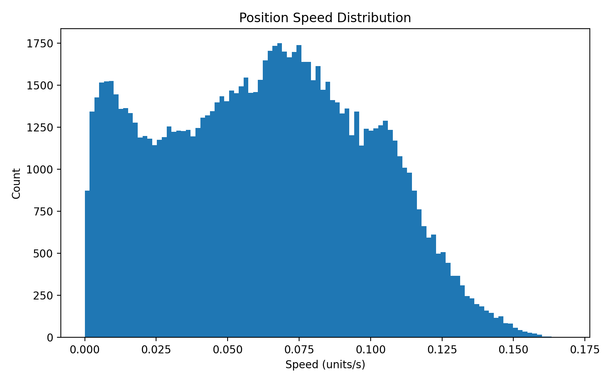
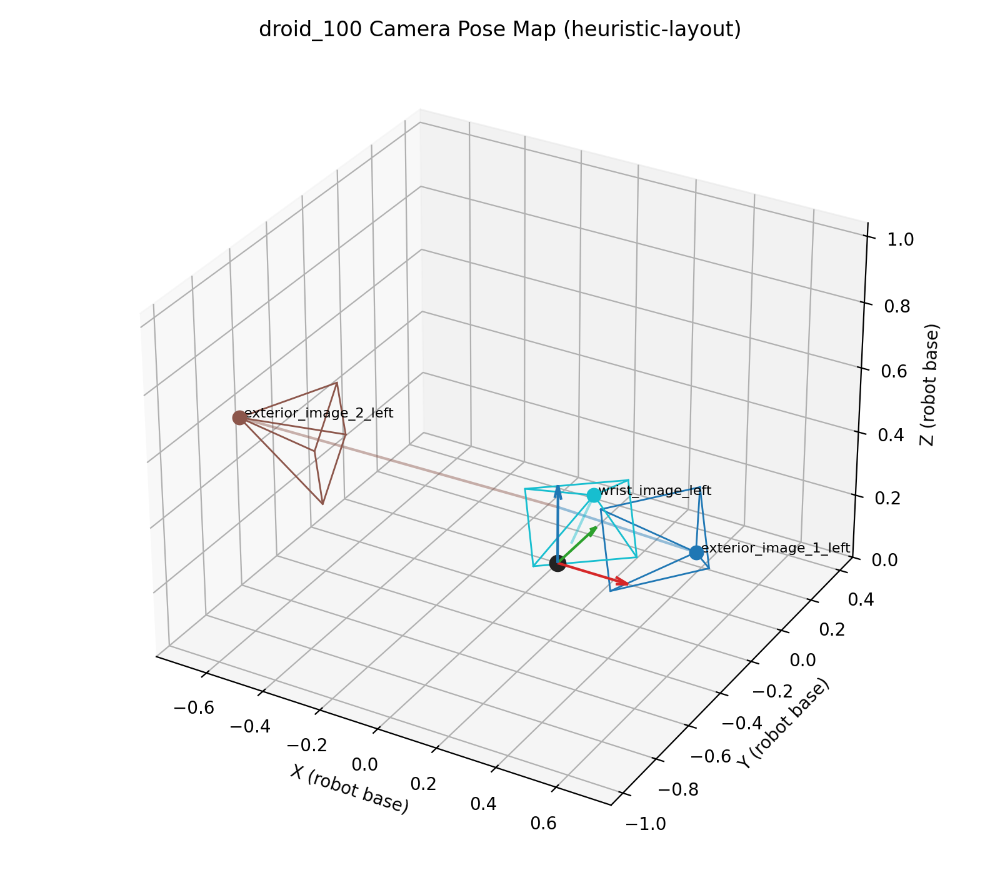
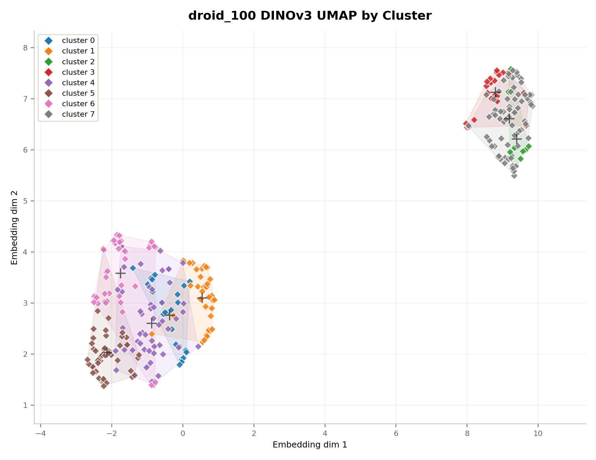
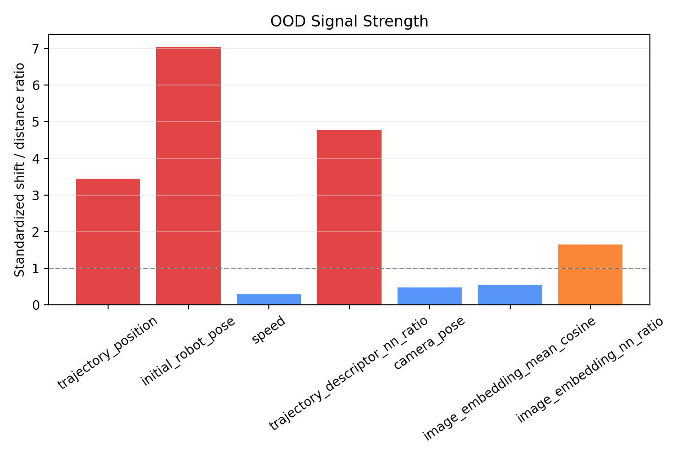
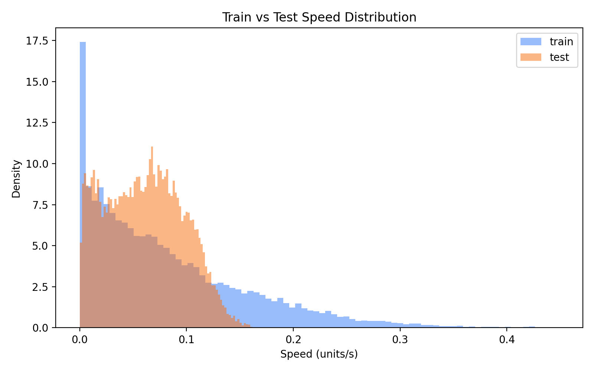

# LeRobot Dataset Trajectory Analyzer

Trajectory statistics and visualizations from [LeRobot](https://github.com/huggingface/lerobot)-format datasets.

- End-effector 2D / 3D position distribution
- EE speed distribution histogram
- **Bimanual robots**: per-arm Cartesian EE position (via FK), per-joint angle distribution, combined both-arm 3D plot
- **Image environment distribution**: first-frame DINOv3 embeddings, UMAP/PCA plots, KMeans clusters, camera pose map
- **OOD analysis**: train/test trajectory, initial robot pose, camera pose, and first-frame image embedding distribution comparison

Configuration (state key, coordinate indices, gripper index) is auto-detected from `meta/info.json` and the parquet schema — no manual setup needed for supported formats.

## Trajectory Distribution Examples

| LIBERO 3D Visualization | LIEBRO Velocity Distribution |
|:--:|:--:|
|  | 

| Human Collected Data | Script Collected Data |
|:--:|:--:|
|  |  |


## Image Distribution Examples (First Frame with DINOv3)

| DROID_100 Camera Pose | DROID_100 image distribution |
|:--:|:--:|
|  | 

## OOD Detection Examples (LIBERO vs DROID_100)

| OOD Signal Bar | Velocity Differences |
|:--:|:--:|
|  | 


---

## Supported Datasets

| Dataset | Robot type | State dim | EE coordinates | Speed unit |
|---------|-----------|-----------|----------------|------------|
| **ALOHA sim** (`aloha_sim_*`) | Bimanual (wx250s × 2) | 14 | Cartesian XYZ via FK (m) | m/s |
| **DROID** (`droid_100`) | Single-arm (7-DOF) | 7 | First 3 state dims | units/s |
| **LIBERO** (`libero_*`) | Single-arm | 8 | x, y, z (from feature names) | units/s |
| **PushT** (`pusht_*`) | 2-DOF end-effector | 2 | 2D XY | px/s |

### General compatibility

Any **LeRobot-format** dataset works as long as it has:

```
<dataset_root>/
  meta/info.json
  data/chunk-000/*.parquet
```

State key auto-detection order: `observation.state` → `state` → `agent_pos` → `action` → first numeric vector feature.

Coordinate detection logic:

| Condition | Behavior |
|-----------|----------|
| Feature names contain `left_*` / `right_*` joints | **Bimanual mode** |
| Feature names contain `x`, `y`, `z` | Use matched indices |
| 3-D+ state, no name match | Use first 3 dimensions |
| 2-D state | 2D plot |

### Bimanual mode (ALOHA / wx250s)

When `robot_type: "aloha"` is in `meta/info.json` and the state feature names match the `left_*` / `right_*` pattern, forward kinematics (FK) is applied using the Interbotix wx250s DH parameters to compute true Cartesian EE positions.

> **Note**: DH parameters are approximate values based on published Interbotix wx250s specs. There may be slight discrepancies from the actual simulation model.

---

## Installation

```bash
python3 -m pip install -r requirements.txt
```

**Requirements**: `numpy>=1.26`, `matplotlib>=3.8`, `pyarrow>=16.0`


```bash
pip install torch==2.7.1 torchvision==0.22.1 torchaudio==2.7.1 --index-url https://download.pytorch.org/whl/cu118
```

Avoid installing `torch`/`torchvision` from both pip and conda in the same environment.

---

## Usage

**Single dataset:**

```bash
python3 visualize.py --dataset-root dataset/droid_100 --output-dir outputs/droid_100
```

**All datasets under a directory:**

```bash
python3 visualize.py --dataset-root dataset --all-datasets --output-dir outputs
```

**Check auto-detected config without generating plots:**

```bash
python3 visualize.py --dataset-root dataset --all-datasets --print-config-only
```

**Image environment distribution with DINOv3:**

```bash
python3 image_clustering.py \
  --dataset-root dataset \
  --all-datasets \
  --output-dir outputs/image_distribution
```

For video-backed datasets such as DROID, the script uses `--video-backend pyav` by default because OpenCV often prints noisy AV1 decoder logs. If your environment has a different decoder setup, you can try `--video-backend auto` or `--video-backend opencv`.

Extracted first frames are cached under `<DATASET>/first_frames/` in the output directory. Re-running the same command reuses those cached images and skips the slow video decode step unless `--no-image-cache` is set.

**Quick camera/sample check without downloading DINOv3:**

```bash
python3 image_clustering.py \
  --dataset-root dataset/aloha_sim_insertion_human_image \
  --skip-embeddings \
  --output-dir outputs/image_distribution/aloha_human_check
```

`image_clustering.py` samples the first frame of each episode for every image/video feature in `meta/info.json` unless `--image-key` is provided. DINOv3 defaults to `facebook/dinov3-vits16-pretrain-lvd1689m` through Hugging Face Transformers.

Camera extrinsics are not included in the current LeRobot metadata files. The script therefore saves `camera_pose_map_3d.png` using a camera-key heuristic by default. For calibrated robot-base camera poses, pass:

```bash
python3 image_clustering.py \
  --dataset-root dataset/aloha_sim_insertion_human_image \
  --camera-pose-json camera_poses.json
```

Example `camera_poses.json`:

```json
{
  "observation.images.top": {
    "position": [0.0, 0.0, 1.25],
    "target": [0.0, 0.0, 0.0]
  }
}
```

**Out-of-distribution analysis:**

`ood_detection.py` compares train/test distributions across trajectory flow, speed, initial robot pose, camera pose, and first-frame image embeddings. Since OOD is subjective in robotics, the script reports multiple signals instead of a single yes/no label.

Randomly split episodes inside selected datasets:

```bash
python3 ood_detection.py \
  --dataset-root dataset \
  --all-datasets \
  --dataset-name droid_100 \
  --dataset-name libero_10_image \
  --output-dir outputs/ood_detection \
  --image-output-dir outputs/image_distribution \
  --train-ratio 0.7 \
  --seed 42
```

Compare two different datasets as train vs test:

```bash
python3 ood_detection.py \
  --train-dataset-root dataset/droid_100 \
  --test-dataset-root dataset/libero_10_image \
  --output-dir outputs/ood_detection/droid_vs_libero \
  --image-output-dir outputs/image_distribution \
  --max-episodes 80 \
  --seed 42
```

Quick run with fewer episodes:

```bash
python3 ood_detection.py \
  --dataset-root dataset/droid_100 \
  --output-dir outputs/ood_detection/droid_100_quick \
  --image-output-dir outputs/image_distribution \
  --max-episodes 30 \
  --train-ratio 0.7 \
  --seed 42
```

Image embedding OOD signals use the cached `embeddings.npz` files from `image_clustering.py`. If those files are missing, trajectory/speed/initial pose analysis still runs, but image embedding plots and metrics are skipped.

**OOD episode inspector:**

`ood_episode_inspector.py` ranks individual test episodes by normalized OOD score and explains which signals drove each score. It uses the train split as the reference distribution, then compares each episode across trajectory descriptors, velocity statistics, initial robot pose, first-frame image embeddings, and camera pose/key patterns.

Run the LIBERO/DROID preset. This creates same-dataset train/test splits for `libero_10_image` and `droid_100`, plus a cross-dataset report using LIBERO as train and DROID as test:

```bash
python3 ood_episode_inspector.py \
  --preset libero_droid \
  --dataset-root dataset \
  --output-dir outputs/ood_episode_inspector \
  --image-output-dir outputs/image_distribution \
  --max-episodes 80 \
  --top-k 20 \
  --seed 42
```

Quick smoke test with fewer episodes:

```bash
python3 ood_episode_inspector.py \
  --preset libero_droid \
  --dataset-root dataset \
  --output-dir outputs/ood_episode_inspector_smoke \
  --image-output-dir outputs/image_distribution \
  --max-episodes 12 \
  --top-k 6 \
  --seed 42
```

Inspect a same-dataset split:

```bash
python3 ood_episode_inspector.py \
  --dataset-root dataset/libero_10_image \
  --output-dir outputs/ood_episode_inspector/libero_split \
  --image-output-dir outputs/image_distribution \
  --train-ratio 0.7 \
  --max-episodes 80 \
  --top-k 20 \
  --seed 42
```

Inspect cross-dataset episodes:

```bash
python3 ood_episode_inspector.py \
  --train-dataset-root dataset/libero_10_image \
  --test-dataset-root dataset/droid_100 \
  --output-dir outputs/ood_episode_inspector/libero_vs_droid \
  --image-output-dir outputs/image_distribution \
  --max-episodes 80 \
  --top-k 20 \
  --seed 42
```

---

## Outputs

### Single-arm / 2D

```
outputs/<DATASET>/
  position_distribution_3d.png   # 3D scatter (if state dim >= 3)
  position_distribution_2d.png   # 2D scatter (if state dim == 2)
  position_projection_xy.png
  position_projection_yz.png
  position_projection_xz.png
  ee_speed_distribution_hist.png
  summary.json
outputs/summary_all.json          # merged summary (--all-datasets only)
```

### Image distribution

```
outputs/image_distribution/
  embeddings.npz                  # Global DINOv3 embeddings + global 2D coords
  embedding_clusters.png           # Global UMAP/PCA colored by KMeans cluster
  embedding_datasets.png           # Global UMAP/PCA colored by dataset
  embedding_cameras.png            # Global UMAP/PCA colored by image key
  cluster_contact_sheet.png        # Global representative first-frame images
  embedding_summary.json
  summary.json
  <DATASET>/
    camera_pose_map_3d.png
    first_frames/*.jpg
    embeddings.npz                # Dataset-only 2D coords/clusters
    embedding_clusters.png         # Dataset-only UMAP/PCA colored by cluster
    embedding_cameras.png          # Dataset-only UMAP/PCA colored by camera
    cluster_contact_sheet.png
    embedding_summary.json
    samples.json
    samples_embedding.json
```

### Bimanual (ALOHA)

```
outputs/<DATASET>/
  left/
    ee_position_3d.png            # Left EE Cartesian scatter
    ee_projection_xy.png
    ee_projection_yz.png
    ee_projection_xz.png
    ee_speed_hist.png             # Left EE speed (m/s)
    joint_distributions.png       # Histogram grid: 6 joints + gripper
  right/
    (same structure as left/)
  ee_bimanual_combined_3d.png     # Both EEs on the same 3D axis
  summary.json
```

### OOD detection

```
outputs/ood_detection/
  summary_all.json
  <DATASET>/
    ood_report.txt                  # Human-readable text summary
    ood_summary.json                # Full machine-readable metrics
    trajectory_train_test_3d.png     # Train/test robot trajectory scatter
    speed_train_test.png             # Train/test speed distribution
    initial_environment_3d.png       # Initial robot pose + camera pose map
    image_embedding_train_test.png   # First-frame embedding split, if available
    ood_signal_bar.png               # Signal-level OOD strength summary
    mean_comparison_bar.png          # Test mean shift relative to train std
```

### OOD episode inspector

```
outputs/ood_episode_inspector/
  summary_all.json
  same_dataset_splits/
    libero_10_image/
      episode_report.txt              # Top OOD episode reasons
      episode_inspector_summary.json  # Full machine-readable report
      episode_scores.csv              # Ranked test episodes
      train_episode_scores.csv        # Train baseline episode scores
      ranked_episode_scores.png       # Stacked score contribution ranking
      score_distribution.png          # Train/test episode score histogram
      reason_signal_heatmap.png       # Signal matrix with train average row
      motion_metric_comparison.png    # Top episodes vs train average/std
    droid_100/
      (same structure)
  cross_dataset/
    libero_10_image_train_vs_droid_100_test/
      (same structure)
```

### Plot annotations

| Visual element | Meaning |
|----------------|---------|
| Point color | Episode progress — blue (start) → red (end) |
| Cyan `▲` | First frame of each episode |
| Red `×` | First frame where the gripper value changes |
| Blue / red tones (bimanual combined) | Left arm / right arm |

### OOD signal interpretation

`ood_signal_bar.png` summarizes how far the test split appears from the train split. Larger bars indicate stronger distribution mismatch. As a rough guide, `0-0.5` is similar, `0.5-1.5` is moderate shift, and `1.5+` is a strong OOD signal.

| Signal | Meaning |
|--------|---------|
| `trajectory_position` | Overall robot trajectory position distribution shift |
| `initial_robot_pose` | Difference in episode starting robot poses |
| `speed` | End-effector speed distribution shift |
| `trajectory_descriptor_nn_ratio` | Test episode-level descriptors compared with train nearest-neighbor distances |
| `camera_pose` | Camera setup/image-key pose shift using metadata or heuristic camera poses |
| `image_embedding_mean_cosine` | Mean first-frame DINO embedding direction difference |
| `image_embedding_nn_ratio` | Test image nearest-neighbor distance relative to train image distances |

For robotics datasets, the most useful reading is usually the pattern across signals: large trajectory/speed bars suggest motion mismatch, large initial-pose bars suggest reset or start-state mismatch, and large image/camera bars suggest environment, viewpoint, or visual appearance mismatch.

### Episode inspector interpretation

The inspector score is a weighted average of per-signal scores normalized by train behavior. A score around the train average is typical for the reference distribution; episodes beyond the train p95 line are stronger OOD candidates.

| Episode signal | Meaning |
|----------------|---------|
| `trajectory` | Episode-level trajectory descriptor nearest-neighbor distance against train |
| `velocity` | Path length, duration, mean speed, p95 speed, and displacement shift |
| `initial_pose` | Starting robot pose distance in train-standardized units |
| `image_embedding` | First-frame visual embedding nearest-neighbor distance |
| `camera_pose` | Camera pose/key pattern shift, using cached image sample metadata |

Useful files to inspect first:

| File | Use |
|------|-----|
| `episode_report.txt` | Human-readable top episode ranking and reasons |
| `episode_scores.csv` | Sort/filter all ranked test episodes by score or signal |
| `ranked_episode_scores.png` | See which signal contributes most for each top episode |
| `reason_signal_heatmap.png` | Compare top episodes against the average train signal row |
| `motion_metric_comparison.png` | Check raw motion metrics against train mean and std |

---

## Options

| Flag | Default | Description |
|------|---------|-------------|
| `--dataset-root` | `dataset/droid_100` | Path to dataset root, or parent dir with `--all-datasets` |
| `--all-datasets` | off | Analyze every child dataset under `--dataset-root` |
| `--output-dir` | `outputs` | Directory for generated plots and JSON |
| `--state-key` | auto | Override state column key |
| `--episode-key` | auto | Override episode index column key |
| `--timestamp-key` | auto | Override timestamp column key |
| `--ee-indices` | auto | Manually specify coordinate indices (2 or 3 values) |
| `--gripper-index` | auto | State index used for gripper open/close detection |
| `--gripper-change-threshold` | `1e-6` | Min change to register a gripper event |
| `--sample-points` | `50000` | Max scatter plot points (downsampled randomly) |
| `--bins` | `100` | Histogram bin count |
| `--seed` | `42` | Random seed for downsampling |
| `--viz-jitter-std` | `0.0` | Gaussian jitter std added to plot points (same unit as coords) |
| `--print-config-only` | off | Print resolved config and exit without plotting |

### OOD options

| Flag | Default | Description |
|------|---------|-------------|
| `--dataset-root` | `dataset` | Dataset root, or parent dir with `--all-datasets` |
| `--dataset-name` | unset | Child dataset name to include; repeat for multiple datasets |
| `--train-dataset-root` | unset | Explicit train dataset root for cross-dataset comparison |
| `--test-dataset-root` | unset | Explicit test dataset root for cross-dataset comparison |
| `--image-output-dir` | `outputs/image_distribution` | Existing image embedding output directory |
| `--train-ratio` | `0.7` | Episode ratio used for random train/test split |
| `--max-episodes` | unset | Cap episode count before splitting/comparison |
| `--sample-points` | `50000` | Max trajectory points shown in split plots |
| `--seed` | `42` | Random seed for episode split and downsampling |

### OOD episode inspector options

| Flag | Default | Description |
|------|---------|-------------|
| `--preset` | `none` | Use `libero_droid` to run LIBERO split, DROID split, and LIBERO-vs-DROID |
| `--dataset-root` | `dataset` | Dataset root, or parent dir used by the preset / `--all-datasets` |
| `--train-dataset-root` | unset | Explicit train dataset root for cross-dataset episode scoring |
| `--test-dataset-root` | unset | Explicit test dataset root for cross-dataset episode scoring |
| `--image-output-dir` | `outputs/image_distribution` | Existing cached image embedding output directory |
| `--train-ratio` | `0.7` | Episode ratio for same-dataset train/test split |
| `--max-episodes` | unset | Cap episode count before splitting/comparison |
| `--top-k` | `20` | Number of highest-scoring episodes shown in plots and summary |
| `--weights` | built-in | Comma-separated signal weights, such as `trajectory=1.2,velocity=1,image_embedding=0.8` |
| `--seed` | `42` | Random seed for episode split and subsampling |

**Examples:**

```bash
# Force specific coordinate indices
python3 visualize.py --dataset-root dataset/droid_100 --ee-indices 0 1 2

# Custom gripper detection threshold
python3 visualize.py --dataset-root dataset/droid_100 --gripper-index 6 --gripper-change-threshold 1e-4

# Spread dense clusters with jitter
python3 visualize.py --dataset-root dataset/droid_100 --viz-jitter-std 0.003

# Non-standard column names
python3 visualize.py \
  --dataset-root <DATASET_ROOT> \
  --state-key <STATE_COLUMN> \
  --episode-key <EPISODE_COLUMN> \
  --timestamp-key <TIMESTAMP_COLUMN>
```

---

The MIT License applies only to the code in this repository, not to external datasets, pretrained weights, or third-party assets.
