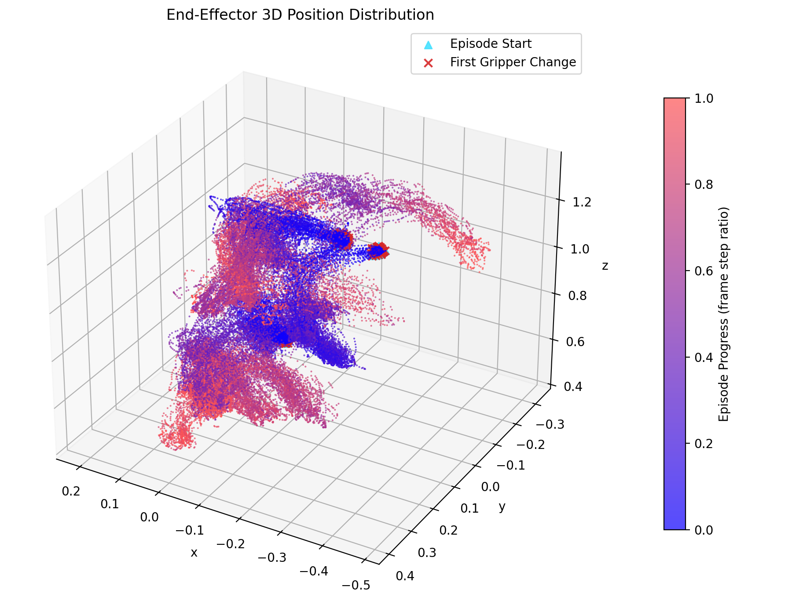
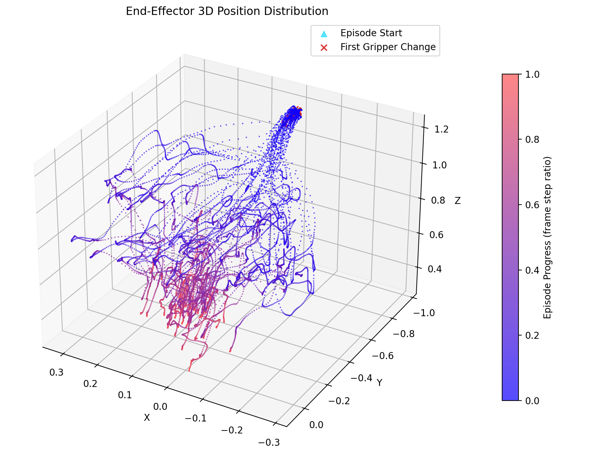
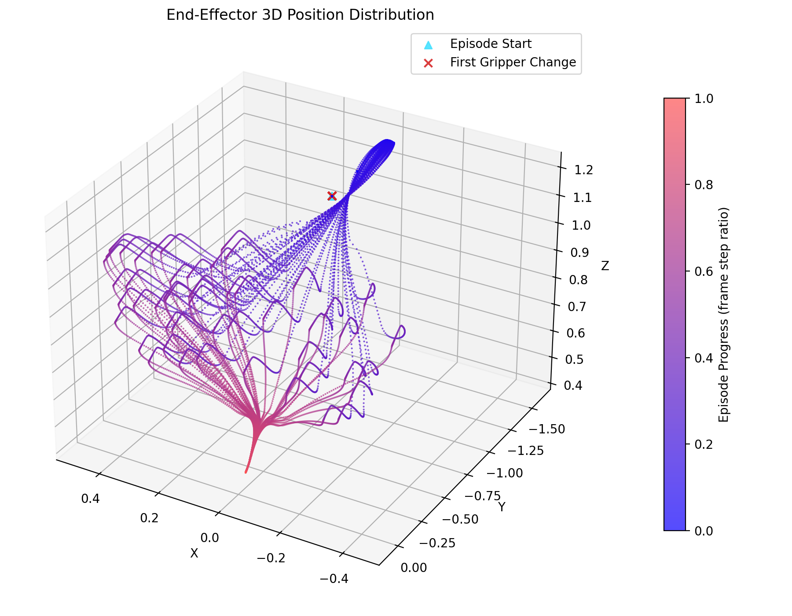
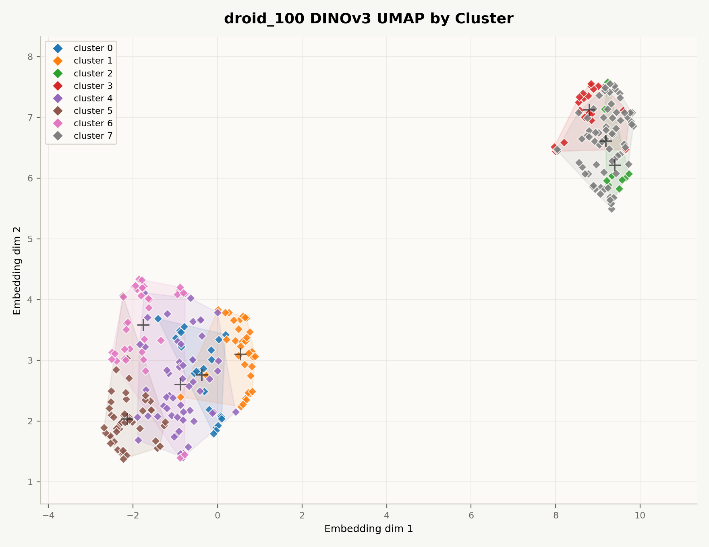

# LeRobot Dataset Trajectory Analyzer

Trajectory statistics and visualizations from [LeRobot](https://github.com/huggingface/lerobot)-format datasets.

- End-effector 2D / 3D position distribution
- EE speed distribution histogram
- **Bimanual robots**: per-arm Cartesian EE position (via FK), per-joint angle distribution, combined both-arm 3D plot
- **Image environment distribution**: first-frame DINOv3 embeddings, UMAP/PCA plots, KMeans clusters, camera pose map

Configuration (state key, coordinate indices, gripper index) is auto-detected from `meta/info.json` and the parquet schema — no manual setup needed for supported formats.

## Trajectory Distribution Examples

| LIBERO 3D Visualization | LIEBRO Velocity Distribution |
|:--:|:--:|
|  | 

| Human Collected Data | Script Collected Data |
|:--:|:--:|
|  |  |


## Image Distribution Examples (First Frame with DINOv3)

| DROID_100 Camera Pose | DROID_100 image distribution |
|:--:|:--:|
|  | 


---

## Supported Datasets

| Dataset | Robot type | State dim | EE coordinates | Speed unit |
|---------|-----------|-----------|----------------|------------|
| **ALOHA sim** (`aloha_sim_*`) | Bimanual (wx250s × 2) | 14 | Cartesian XYZ via FK (m) | m/s |
| **DROID** (`droid_100`) | Single-arm (7-DOF) | 7 | First 3 state dims | units/s |
| **LIBERO** (`libero_*`) | Single-arm | 8 | x, y, z (from feature names) | units/s |
| **PushT** (`pusht_*`) | 2-DOF end-effector | 2 | 2D XY | px/s |

### General compatibility

Any **LeRobot-format** dataset works as long as it has:

```
<dataset_root>/
  meta/info.json
  data/chunk-000/*.parquet
```

State key auto-detection order: `observation.state` → `state` → `agent_pos` → `action` → first numeric vector feature.

Coordinate detection logic:

| Condition | Behavior |
|-----------|----------|
| Feature names contain `left_*` / `right_*` joints | **Bimanual mode** |
| Feature names contain `x`, `y`, `z` | Use matched indices |
| 3-D+ state, no name match | Use first 3 dimensions |
| 2-D state | 2D plot |

### Bimanual mode (ALOHA / wx250s)

When `robot_type: "aloha"` is in `meta/info.json` and the state feature names match the `left_*` / `right_*` pattern, forward kinematics (FK) is applied using the Interbotix wx250s DH parameters to compute true Cartesian EE positions.

> **Note**: DH parameters are approximate values based on published Interbotix wx250s specs. There may be slight discrepancies from the actual simulation model.

---

## Installation

```bash
python3 -m pip install -r requirements.txt
```

**Requirements**: `numpy>=1.26`, `matplotlib>=3.8`, `pyarrow>=16.0`


```bash
pip install torch==2.7.1 torchvision==0.22.1 torchaudio==2.7.1 --index-url https://download.pytorch.org/whl/cu118
```

Avoid installing `torch`/`torchvision` from both pip and conda in the same environment.

---

## Usage

**Single dataset:**

```bash
python3 visualize.py --dataset-root dataset/droid_100 --output-dir outputs/droid_100
```

**All datasets under a directory:**

```bash
python3 visualize.py --dataset-root dataset --all-datasets --output-dir outputs
```

**Check auto-detected config without generating plots:**

```bash
python3 visualize.py --dataset-root dataset --all-datasets --print-config-only
```

**Image environment distribution with DINOv3:**

```bash
python3 image_clustering.py \
  --dataset-root dataset \
  --all-datasets \
  --output-dir outputs/image_distribution
```

For video-backed datasets such as DROID, the script uses `--video-backend pyav` by default because OpenCV often prints noisy AV1 decoder logs. If your environment has a different decoder setup, you can try `--video-backend auto` or `--video-backend opencv`.

Extracted first frames are cached under `<DATASET>/first_frames/` in the output directory. Re-running the same command reuses those cached images and skips the slow video decode step unless `--no-image-cache` is set.

**Quick camera/sample check without downloading DINOv3:**

```bash
python3 image_clustering.py \
  --dataset-root dataset/aloha_sim_insertion_human_image \
  --skip-embeddings \
  --output-dir outputs/image_distribution/aloha_human_check
```

`image_clustering.py` samples the first frame of each episode for every image/video feature in `meta/info.json` unless `--image-key` is provided. DINOv3 defaults to `facebook/dinov3-vits16-pretrain-lvd1689m` through Hugging Face Transformers.

Camera extrinsics are not included in the current LeRobot metadata files. The script therefore saves `camera_pose_map_3d.png` using a camera-key heuristic by default. For calibrated robot-base camera poses, pass:

```bash
python3 image_clustering.py \
  --dataset-root dataset/aloha_sim_insertion_human_image \
  --camera-pose-json camera_poses.json
```

Example `camera_poses.json`:

```json
{
  "observation.images.top": {
    "position": [0.0, 0.0, 1.25],
    "target": [0.0, 0.0, 0.0]
  }
}
```

---

## Outputs

### Single-arm / 2D

```
outputs/<DATASET>/
  position_distribution_3d.png   # 3D scatter (if state dim >= 3)
  position_distribution_2d.png   # 2D scatter (if state dim == 2)
  position_projection_xy.png
  position_projection_yz.png
  position_projection_xz.png
  ee_speed_distribution_hist.png
  summary.json
outputs/summary_all.json          # merged summary (--all-datasets only)
```

### Image distribution

```
outputs/image_distribution/
  embeddings.npz                  # Global DINOv3 embeddings + global 2D coords
  embedding_clusters.png           # Global UMAP/PCA colored by KMeans cluster
  embedding_datasets.png           # Global UMAP/PCA colored by dataset
  embedding_cameras.png            # Global UMAP/PCA colored by image key
  cluster_contact_sheet.png        # Global representative first-frame images
  embedding_summary.json
  summary.json
  <DATASET>/
    camera_pose_map_3d.png
    first_frames/*.jpg
    embeddings.npz                # Dataset-only 2D coords/clusters
    embedding_clusters.png         # Dataset-only UMAP/PCA colored by cluster
    embedding_cameras.png          # Dataset-only UMAP/PCA colored by camera
    cluster_contact_sheet.png
    embedding_summary.json
    samples.json
    samples_embedding.json
```

### Bimanual (ALOHA)

```
outputs/<DATASET>/
  left/
    ee_position_3d.png            # Left EE Cartesian scatter
    ee_projection_xy.png
    ee_projection_yz.png
    ee_projection_xz.png
    ee_speed_hist.png             # Left EE speed (m/s)
    joint_distributions.png       # Histogram grid: 6 joints + gripper
  right/
    (same structure as left/)
  ee_bimanual_combined_3d.png     # Both EEs on the same 3D axis
  summary.json
```

### Plot annotations

| Visual element | Meaning |
|----------------|---------|
| Point color | Episode progress — blue (start) → red (end) |
| Cyan `▲` | First frame of each episode |
| Red `×` | First frame where the gripper value changes |
| Blue / red tones (bimanual combined) | Left arm / right arm |

---

## Options

| Flag | Default | Description |
|------|---------|-------------|
| `--dataset-root` | `dataset/droid_100` | Path to dataset root, or parent dir with `--all-datasets` |
| `--all-datasets` | off | Analyze every child dataset under `--dataset-root` |
| `--output-dir` | `outputs` | Directory for generated plots and JSON |
| `--state-key` | auto | Override state column key |
| `--episode-key` | auto | Override episode index column key |
| `--timestamp-key` | auto | Override timestamp column key |
| `--ee-indices` | auto | Manually specify coordinate indices (2 or 3 values) |
| `--gripper-index` | auto | State index used for gripper open/close detection |
| `--gripper-change-threshold` | `1e-6` | Min change to register a gripper event |
| `--sample-points` | `50000` | Max scatter plot points (downsampled randomly) |
| `--bins` | `100` | Histogram bin count |
| `--seed` | `42` | Random seed for downsampling |
| `--viz-jitter-std` | `0.0` | Gaussian jitter std added to plot points (same unit as coords) |
| `--print-config-only` | off | Print resolved config and exit without plotting |

**Examples:**

```bash
# Force specific coordinate indices
python3 visualize.py --dataset-root dataset/droid_100 --ee-indices 0 1 2

# Custom gripper detection threshold
python3 visualize.py --dataset-root dataset/droid_100 --gripper-index 6 --gripper-change-threshold 1e-4

# Spread dense clusters with jitter
python3 visualize.py --dataset-root dataset/droid_100 --viz-jitter-std 0.003

# Non-standard column names
python3 visualize.py \
  --dataset-root <DATASET_ROOT> \
  --state-key <STATE_COLUMN> \
  --episode-key <EPISODE_COLUMN> \
  --timestamp-key <TIMESTAMP_COLUMN>
```
